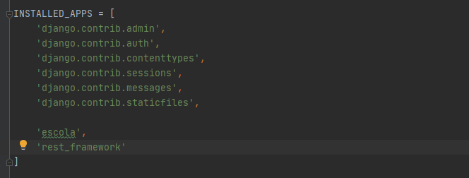
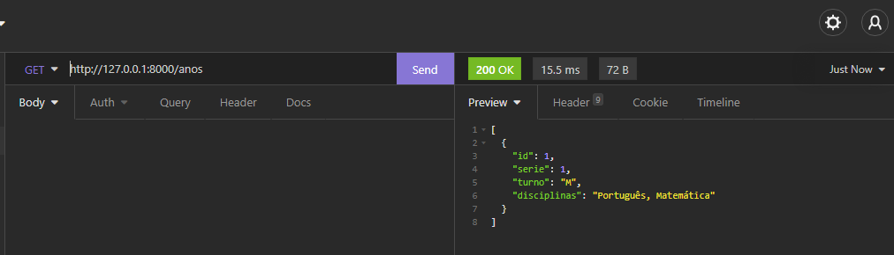

# Getting Started
```bash
# Clone repository
git clone https://github.com/mikaelsonbraz/API_escola.git

# Create Virtual Environment
python -m venv venv && ./venv/Scripts/Activate.ps1

# Install dependencies
pip install -r requirements.txt

# Run Application
python manage.py runserver
```

# API para uma escola

* [Introdução](#introdução)
* [Preparando o Ambiente](#preparando-o-ambiente)
* [Projeto x App](#projeto-x-app)
* [Criando os modelos e API](#criando-os-modelos-e-api)
* [Criação das rotas](#criação-das-rotas)
* [Getting Started](#getting-started)

# Introdução
A ideia do projeto é que possamos armazenar os dados de alunos e turmas e seus atributos dentro de um banco de dados e realizar as operações de <a href="https://github.com/Mesheo/first-crud-django">CRUD</a> sem precisar de uma interface gráfica. Assim, outra aplicação poderá se comunicar com a nossa de forma eficiente.<br> Esse é o conceito de API (Application Programming Interface)

# Preparando o ambiente
Aqui temos a receita de bolo pra deixar a sua máquina pronta para levantar um servidor com o django e receber aquele **200** bonito na cara

```bash
>python -m venv venv #criando ambiente virtual na sua versao do python
>./venv/Scripts/Activate.ps1 #Ativando o ambiente virtual
>pip install django djangorestframework #instalação local das nossas dependências
```
O lance do ambiente virtual é que todas suas dependências *(que no python costumam ser muitas)*  ficam apenas num diretório específico. <br>
Logo, com uma venv você pode criar projetos que usam versões diferentes da mesma biblioteca sem que haja conflito na hora do import.

# Projeto x App
No django cada **project** pode carregar múltiplos **apps**, como um projeto site de esportes que pode ter um app para os artigos, outro para rankings etc.<br>
Ainda no terminal usamos os comandos a seguir para criar o project **library** que vai carregar nosso app **books**. 

```bash
>django-admin startproject library . #ponto indica diretório atual
>django-admin startapp books
>python manage.py runserver #pra levantarmos o servidor local com a aplicação
```

Para criar as tabelas no banco de dados (Por enquanto *Sqlite3*) executamos o comando
```bash
>python manage.py migrate
```

# Criando os modelos e API
No arquivo **./config/settings.py** precisamos indicar ao nosso projeto library sobre a existência do app escola e também o uso do rest framework. Portanto adicionamos as seguintes linhas sublinhadas




Agora em **./config/escola/models.py** iremos criar nosso modelo com os atributos que um ano e um aluno devem ter.

```py
from django.db import models
from uuid import uuid4


class Ano(models.Model):
    TURNOS_CHOICES = (
        ('M', "Matutino"),
        ('V', 'Vespertino'),
        ('N', 'Noturno')
    )

    serie = models.IntegerField()
    turno = models.CharField(max_length=1, choices=TURNOS_CHOICES, blank=False, null=False)
    qtd_turmas = models.IntegerField()
    qtd_alunos_por_turma = models.IntegerField()
    disciplinas = models.TextField()

    def getSerie(self):
        return self.serie

    def getDisciplinas(self):
        return self.disciplinas

    def __str__(self):
        return f'Ano {self.serie}, Turno {self.turno}, Disciplinas: {self.disciplinas}'

#-----------------------------------------------------------------------------------------------------------------------

class Aluno(models.Model):
    SEXO_CHOICES = (
        ("F", "Feminino"),
        ("M", "Masculino"),
        ("N", "Nenhuma das opções")
    )

    id_aluno = models.UUIDField(primary_key=True, default=uuid4, editable=False)
    nome = models.CharField(max_length=255)
    turma = models.ForeignKey(Ano, on_delete=models.CASCADE, related_name='turmaAluno')
    rg_cpf = models.CharField(max_length=11)
    sexo = models.CharField(max_length=1, choices=SEXO_CHOICES, blank=False, null=False)
    matricula = models.IntegerField(unique=True)
    nomeMae = models.CharField(max_length=255)
    nomePai = models.CharField(max_length=255)
    desblocado = models.BooleanField(default=False)
    nascimento = models.DateField()
    ingresso = models.DateField()

    def __str__(self):
        return f'{self.nome} - Matrícula: {self.matricula}'

```
## Serializers e Viewsets
Dentro de **./conffig/escola** iremos criar a pasta **/api** com os arquivos 
* serializers.py 
* viewsets.py 

### Serializers
```py
from rest_framework import serializers
from escola.models import Ano, Aluno


class AnoSerializer(serializers.ModelSerializer):
    class Meta:
        model = Ano
        fields = ['id', 'serie', 'turno', 'disciplinas']


class AlunoSerializer(serializers.ModelSerializer):
    class Meta:
        model = Aluno
        fields = ['id_aluno', 'nome', 'turma', 'matricula', 'desblocado', 'nascimento', 'ingresso']

```

### Viewsets
```py
from rest_framework import viewsets
from escola.models import Ano, Aluno
from escola.api import serializer


class AnosViewSet(viewsets.ModelViewSet):
    queryset = Ano.objects.all()
    serializer_class = serializer.AnoSerializer


class AlunosViewSet(viewsets.ModelViewSet):
    queryset = Aluno.objects.all()
    serializer_class = serializer.AlunoSerializer
    
```
# Criação das rotas
Agora com o viewset e o serializer a única coisa que falta é uma rota. Portanto vamos para **./config/urls.py** resolver esse problema

```py
from django.contrib import admin
from django.urls import path, include

from escola.api.viewsets import AnosViewSet, AlunosViewSet
from rest_framework import routers

router = routers.DefaultRouter()
router.register(r'', AnosViewSet)

router2 = routers.DefaultRouter()
router2.register(r'alunos', AlunosViewSet)

urlpatterns = [
    path('admin/', admin.site.urls),
    path(r'anos', include(router.urls)),
    path(r'', include(router2.urls))
]

```
Como criamos um modelo novo lá em cima, precisamos avisar e em seguida migrar todos essas novas informações para o banco de dados

```bash
>python manage.py makemigrations 
>python manage.py migrate
>python manage.py runserver 
```
Agora você pode usar um programa como <a href="https://insomnia.rest/">Insomnia</a> para testar os métodos http no link do seu servidor local. 🥰



>O python facilita bastante coisas para a gente, como os serializers (que convertem objetos para strings na comunicação cliente-servidor) e os verbos http (GET, POST, PUT, DELETE) que de certa forma também vem por padrão. Não me aprofundei neles durante o readme porque também preciso entender melhor como essas coisas funcionam

